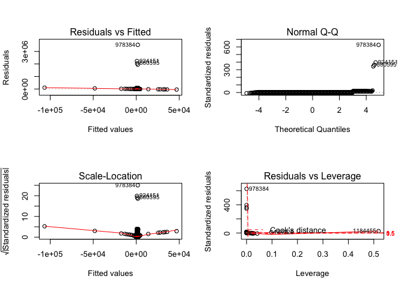

Title: R notebook for Linear Regression in MD
Date: 2017-08-18 18:32
Category: R md

Loading Libraries
-----------------

``` r
library(tidyverse)
```

    ## Loading tidyverse: ggplot2
    ## Loading tidyverse: tibble
    ## Loading tidyverse: tidyr
    ## Loading tidyverse: readr
    ## Loading tidyverse: purrr
    ## Loading tidyverse: dplyr

    ## Conflicts with tidy packages ----------------------------------------------

    ## filter(): dplyr, stats
    ## lag():    dplyr, stats

``` r
library(lubridate)
```

    ## 
    ## Attaching package: 'lubridate'

    ## The following object is masked from 'package:base':
    ## 
    ##     date

``` r
library(caret)
```

    ## Loading required package: lattice

    ## 
    ## Attaching package: 'caret'

    ## The following object is masked from 'package:purrr':
    ## 
    ##     lift

``` r
library(broom)
```

Cleanup
-------

``` r
rm(list = ls())
```

Read train data
---------------

``` r
train = read_csv("train.csv")
```

    ## Parsed with column specification:
    ## cols(
    ##   id = col_character(),
    ##   vendor_id = col_integer(),
    ##   pickup_datetime = col_datetime(format = ""),
    ##   dropoff_datetime = col_datetime(format = ""),
    ##   passenger_count = col_integer(),
    ##   pickup_longitude = col_double(),
    ##   pickup_latitude = col_double(),
    ##   dropoff_longitude = col_double(),
    ##   dropoff_latitude = col_double(),
    ##   store_and_fwd_flag = col_character(),
    ##   trip_duration = col_integer()
    ## )

``` r
head(train)
```

    ## # A tibble: 6 x 11
    ##          id vendor_id     pickup_datetime    dropoff_datetime
    ##       <chr>     <int>              <dttm>              <dttm>
    ## 1 id2875421         2 2016-03-14 17:24:55 2016-03-14 17:32:30
    ## 2 id2377394         1 2016-06-12 00:43:35 2016-06-12 00:54:38
    ## 3 id3858529         2 2016-01-19 11:35:24 2016-01-19 12:10:48
    ## 4 id3504673         2 2016-04-06 19:32:31 2016-04-06 19:39:40
    ## 5 id2181028         2 2016-03-26 13:30:55 2016-03-26 13:38:10
    ## 6 id0801584         2 2016-01-30 22:01:40 2016-01-30 22:09:03
    ## # ... with 7 more variables: passenger_count <int>,
    ## #   pickup_longitude <dbl>, pickup_latitude <dbl>,
    ## #   dropoff_longitude <dbl>, dropoff_latitude <dbl>,
    ## #   store_and_fwd_flag <chr>, trip_duration <int>

``` r
lapply(train, class)
```

    ## $id
    ## [1] "character"
    ## 
    ## $vendor_id
    ## [1] "integer"
    ## 
    ## $pickup_datetime
    ## [1] "POSIXct" "POSIXt" 
    ## 
    ## $dropoff_datetime
    ## [1] "POSIXct" "POSIXt" 
    ## 
    ## $passenger_count
    ## [1] "integer"
    ## 
    ## $pickup_longitude
    ## [1] "numeric"
    ## 
    ## $pickup_latitude
    ## [1] "numeric"
    ## 
    ## $dropoff_longitude
    ## [1] "numeric"
    ## 
    ## $dropoff_latitude
    ## [1] "numeric"
    ## 
    ## $store_and_fwd_flag
    ## [1] "character"
    ## 
    ## $trip_duration
    ## [1] "integer"

``` r
summary(train$trip_duration)
```

    ##    Min. 1st Qu.  Median    Mean 3rd Qu.    Max. 
    ##       1     397     662     959    1075 3526282

``` r
train %>% filter(passenger_count>1)
```

    ## # A tibble: 425,044 x 11
    ##           id vendor_id     pickup_datetime    dropoff_datetime
    ##        <chr>     <int>              <dttm>              <dttm>
    ##  1 id0801584         2 2016-01-30 22:01:40 2016-01-30 22:09:03
    ##  2 id1813257         1 2016-06-17 22:34:59 2016-06-17 22:40:40
    ##  3 id1299289         2 2016-05-15 11:16:11 2016-05-15 11:34:59
    ##  4 id1187965         2 2016-02-19 09:52:46 2016-02-19 10:11:20
    ##  5 id3075902         2 2016-05-10 19:27:38 2016-05-10 19:44:40
    ##  6 id1870624         1 2016-01-05 15:29:54 2016-01-05 15:39:07
    ##  7 id3323083         1 2016-05-27 14:26:12 2016-05-27 14:46:01
    ##  8 id0578558         1 2016-04-21 21:28:27 2016-04-21 21:52:37
    ##  9 id2573056         2 2016-04-14 13:27:52 2016-04-14 13:46:14
    ## 10 id2391523         1 2016-05-18 21:50:24 2016-05-18 22:10:41
    ## # ... with 425,034 more rows, and 7 more variables: passenger_count <int>,
    ## #   pickup_longitude <dbl>, pickup_latitude <dbl>,
    ## #   dropoff_longitude <dbl>, dropoff_latitude <dbl>,
    ## #   store_and_fwd_flag <chr>, trip_duration <int>

Modelling a Simple Linear Regression Model
------------------------------------------

``` r
split.train = createDataPartition(y = train$trip_duration, p = 0.8)
trainingSet = split.train$Resample1
testSet = -trainingSet
```

``` r
lm.fit = lm(trip_duration ~ vendor_id + passenger_count + pickup_longitude + pickup_latitude, data = train, subset = trainingSet)
tidy(lm.fit)
```

    ##               term     estimate   std.error  statistic       p.value
    ## 1      (Intercept) 381448.54662 8932.062651  42.705539  0.000000e+00
    ## 2        vendor_id    197.46849   10.905411  18.107386  2.852017e-73
    ## 3  passenger_count     11.08229    4.136893   2.678892  7.386727e-03
    ## 4 pickup_longitude   2572.12585   83.809885  30.690006 9.360135e-207
    ## 5  pickup_latitude  -4675.72865  157.552855 -29.677207 1.785679e-193

``` r
aug = augment(lm.fit)
```

    ## Warning: Deprecated: please use `purrr::possibly()` instead

    ## Warning: Deprecated: please use `purrr::possibly()` instead

    ## Warning: Deprecated: please use `purrr::possibly()` instead

    ## Warning: Deprecated: please use `purrr::possibly()` instead

    ## Warning: Deprecated: please use `purrr::possibly()` instead

``` r
head(aug)
```

    ##   .rownames trip_duration vendor_id passenger_count pickup_longitude
    ## 1         2           663         1               1        -73.98042
    ## 2         3          2124         2               1        -73.97903
    ## 3         4           429         2               1        -74.01004
    ## 4         5           435         2               1        -73.97305
    ## 5         6           443         2               6        -73.98286
    ## 6         7           341         1               4        -73.96902
    ##   pickup_latitude   .fitted   .se.fit    .resid         .hat   .sigma
    ## 1        40.73856  887.6898  7.976094 -224.6898 2.008782e-06 5627.612
    ## 2        40.76394  970.0815  8.529686 1153.9185 2.297303e-06 5627.611
    ## 3        40.71997 1095.8942 10.104003 -666.8942 3.223584e-06 5627.612
    ## 4        40.79321  848.5875 10.602512 -413.5875 3.549520e-06 5627.612
    ## 5        40.74220 1117.3098 18.016384 -674.3098 1.024914e-05 5627.612
    ## 6        40.75784  860.1268 13.727542 -519.1268 5.950284e-06 5627.612
    ##        .cooksd  .std.resid
    ## 1 6.404470e-10 -0.03992637
    ## 2 1.931758e-08  0.20504620
    ## 3 9.053947e-09 -0.11850420
    ## 4 3.834332e-09 -0.07349271
    ## 5 2.943048e-08 -0.11982233
    ## 6 1.012679e-08 -0.09224669

``` r
par(mfrow = c(2,2))
plot(lm.fit)
```


